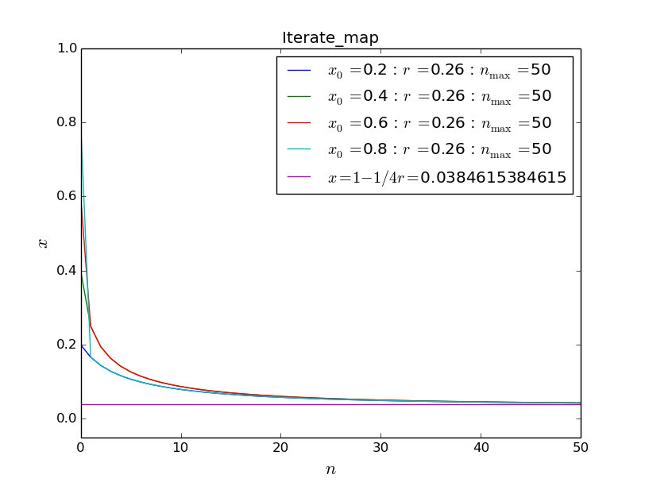

.. _6-1-label:

========================================
問題6.1 - 周期倍化
========================================

.. contents::

シミュレーションの目的
============================

生物の個体数の時間発展は、その世代交代がある決まった季節に起こるなど、離散的であると見なせるため、これを記述するのには微分方程式よりもむしろ差分方程式の方が適している。世代(n+1)の個体数を世代nの個体数に関係づけ、その成長率が密度に依存しない一番簡単なモデルを考えると、世代nの個体数を\ :math:`P_{n}`\ 、成長率を\ :math:`\alpha`\ (定数)として

.. math:: P_{n+1}=\alpha P_{n}
 
と書ける。これは大変簡単ではあるが、\ :math:`\alpha > 1`\ のときに個体数が等比級数的に無限に増加してしまうことと、現実には個体数はその環境に制限されていることとから、現象を的確に表したモデルとは言えない。そこで次に、成長率が個体数が増加するにつれて線形に減少する場合

.. math:: P_{n+1}=P_{n}(a-bP_{n})

を考える。このときこの式は\ :math:`P_{n}`\ の2乗を含んでいるので、非線形の方程式となる。\ :math:`P_{n}=(a/b)x_{n}`\ と置くことで個体数のスケールを変換し、

.. math:: x_{n+1}=ax_{n}

として\ :math:`P_{n}`\ を\ :math:`x_{n}`\ に置き換えると、いろいろなパラメータを定義している単位系も変換される。ここでパラメータ\ :math:`r=a/4`\ を導入して、再び書き直すと

.. math:: x_{n+1}=f(x_{n})=4rx_{n}(1-x_{n})
    :label: logistic

となる。これは単一のパラメータ\ :math:`r`\ のみでその動的な性質が決定されるという意味で望ましいモデルとなっている。ただし、\ :math:`x_{n} > 1`\ のとき\ :math:`x_{n+1}`\ は負になるので、このような非物理的性質が現れないように、xとrを区間\ :math:`0 \leq x \leq 1`\ 、\ :math:`0 \leq r \leq 1`\ に制限することにする。

式\ :eq:`logistic`\ で定義される関数\ :math:`f`\ は1次元の写像であり、この形はロジスティック写像として知られているものである。ロジスティック写像は、系の未来の状態が決定論的に与えられるという意味で、単純な力学系の例である。本シミュレーションでは式\ :eq:`logistic`\ の差分方程式を、世代ごとに計算を繰り返す方法で実際に求め、ロジスティック写像の動的な性質を調べることにする。

作成したプログラム
=============================
ロジスティック写像の性質を調べるために、Pythonを使用したプログラムを以下に示す。

* :download:`6-1_iterate_map.py <6-1_iterate_map.py>`

.. literalinclude:: 6-1_iterate_map.py
    :language: python
    :linenos:

このプログラムは、追加のモジュールとして、グラフ描画に便利なmatplotlibを使用している。プログラムを実行すると各パラメータ{x0, r, nmax}(x0: xの初期値\ :math:`x_{0}`\ 、r: 制御パラメータ、nmax: 演算する世代数)の設定ダイアログが開き、OKボタンをすことでその値で計算されたロジスティック写像のグラフが自動的に描画される。

実習課題
=====================

a. \ :math:`r=0.24`\ とおいてさまざまな初期値\ :math:`x_{0}`\ について動的な振る舞いを調べよ。\ :math:`x=0`\ が安定な固定点であることを示せ。\ :math:`r`\ の値が十分に小さいときには、計算を反復して求めた\ :math:`x`\ の値が、初期値\ :math:`x_{0}`\ とは無関係に\ :math:`x=0`\ に収束する。\ :math:`x`\ が昆虫の個体数を表すと考えて、個体数の定性的な振る舞いについて調べよ。

:math:`r=0.24`\ とおいて\ :math:`x_{0}=0, 0.2, 0.4, 0.6, 0.8, 1.0`\ とした時のグラフを\ :num:`図#fig-6-1-f1`\ に示した。このグラフから確かめられるように、\ :math:`r`\ の値が十分小さい時には、初期値によらず\ :math:`x`\ の値は\ :math:`x=0`\ に単調に収束する。\ :math:`x`\ が昆虫の個体数を表すと見るなら、\ :math:`r`\ の値が小さいということは、個体数の増加率が1よりも小さくなる状態を表しており、生まれてくる個体よりも死ぬ個体のほうが多い状態とも言えるだろう。そのような状況では、個体数は減り続け、いずれ0になる。

.. _fig-6-1-f1:

    
    \ :math:`r = 0.24`\ とおいて\ :math:`x_{0} = 0, 0.2, 0.4, 0.6, 0.8, 1.0`\ とした時のグラフ
    
    
  
b. 式(1)の動的な性質を\ :math:`r=0.26, 0.5, 0.74, 0.748`\ について調べよ。\ :math:`r > 0.25`\ では\ :math:`x=0`\ が不安定な固定点であることを確かめよ。与えられた\ :math:`r`\ の値では、計算の反復で得られる\ :math:`x`\ の値は初期値の過渡点を過ぎると変化しないこと、つまり、長時間後の動的な振る舞いは周期1であることを示せ。\ :math:`r < 3/4`\ について区間\ :math:`0 < x_{0} < 1`\ の\ :math:`x_{0}`\ を初期値とするすべての軌跡が\ :math:`x=1-1/4r`\ のアトラクタに近づくことが示されている。軌跡がアトラクタに吸い込まれる初期値の集合をそのアトラクタの吸引域と呼ぶ。ロジスティック写像では、領域\ :math:`0 < x_{0} < 1`\ は\ :math:`x=1-1/4r`\ のアトラクタの吸引域である。
 

:math:`r=0.26, 0.5, 0.74, 0.748`\ とおいたとき、さまざまな\ :math:`x_{0}`\ を初期値として設定しグラフを描いた。これらを\ :num:`図#fig-6-1-f2`\ 、\ :num:`図#fig-6-1-f3`\ 、\ :num:`図#fig-6-1-f4`\ 、\ :num:`図#fig-6-1-f5`\ に示す。これらの結果から、この範囲の\ :math:`r`\ では\ :math:`x`\ の値は、振動しながら一定の値に収束していき、長時間後にはその動的な振る舞いが周期1であることがわかる。また、その時収束する値は\ :math:`1-1/4r`\ と等しくなっていることがわかる。

.. _fig-6-1-f2:

    \ :math:`r = 0.26`\ とおいて\ :math:`x_{0} = 0.2, 0.4, 0.6, 0.8`\ とした時のグラフ   
    

.. _fig-6-1-f3:

    
    \ :math:`r = 0.5`\ とおいて\ :math:`x_{0} = 0.2, 0.4, 0.6, 0.8`\ とした時のグラフ

    
    
.. _fig-6-1-f4:

    
    \ :math:`r = 0.74`\ とおいて\ :math:`x_{0} = 0.2, 0.4, 0.6, 0.8`\ とした時のグラフ

    
    
.. _fig-6-1-f5:

    
    \ :math:`r = 0.748`\ とおいて\ :math:`x_{0} = 0.2, 0.8`\ とした時のグラフ
  
    
    
c. \ :math:`r=0.752, 0.76, 0.8, 0.862`\ について式(1)の動的な性質を調べよ。\ :math:`r`\ を0.75よりほんの少し大きくすると、初期値の過渡的な振る舞いの後に、2つの数値の間を振動することを示せ。つまり、単一の固定点に対応する周期1の安定なサイクルの代わりに、系は周期2の安定なサイクルを持つようになる。1つの固定点\ :math:`x^{*}`\ が2つの\ :math:`x_{1}^{*}`\ と\ :math:`x_{2}^{*}`\ に分かれる。つまり、分岐する\ :math:`r`\ の値は\ :math:`r=b_{1}=3/4`\ である。1対の\ :math:`x`\ (\ :math:`x_{1}^{*}`\ と\ :math:`x_{2}^{*}`\ )は1つの、周期2の安定なアトラクタを形成する。
 
:math:`r=0.752, 0.76, 0.8, 0.862`\ について\ :math:`x_{0}`\ をさまざまに変えたときのグラフを\ :num:`図#fig-6-1-f6`\ 、\ :num:`図#fig-6-1-f7`\ 、\ :num:`図#fig-6-1-f8`\ 、\ :num:`図#fig-6-1-f9`\ に示す。これらのグラフから見て取れるように、十分時間が経過した後も、\ :math:`x`\ の値は一つの値に収束することなく、二つの値の間を周期2で振動していることがわかる。

.. _fig-6-1-f6:

    
    \ :math:`r = 0.752`\ とおいて\ :math:`x_{0} = 0.2, 0.8`\ とした時のグラフ
    
    
.. _fig-6-1-f7:

    
    \ :math:`r = 0.76`\ とおいて\ :math:`x_{0} = 0.2, 0.8`\ とした時のグラフ
    
.. _fig-6-1-f8:

    
    \ :math:`r = 0.8`\ とおいて\ :math:`x_{0} = 0.2, 0.8`\ とした時のグラフ
    
    
.. _fig-6-1-f9:

    
    \ :math:`r = 0.862`\ とおいて\ :math:`x_{0} = 0.2, 0.8`\ とした時のグラフ
    
      

  
d. 設問cで観測したものと同様な動的振る舞いを示す、昆虫の個体数の生態学的なシナリオについて述べよ。
 

設問cで観測されたような動的な振る舞いは、ある昆虫が、限られた環境の中で成長率が十分にあるために個体数が増えていき、しかし一方で個体数の増加による各種資源の枯渇など、成長率への負の影響のために、個体数を増やし続けることができず、次の世代ではその数が減少してしまうような場合であると考えることができる。

  
e. \ :math:`r=0.863, 0.88`\ では、式\ :eq:`logistic`\ の安定なアトラクタとその周期はどうなるか。
 

:math:`r=0.863, 0.88`\ で\ :math:`x_{0}=0.2`\ とした時のグラフを\ :num:`図#fig-6-1-f10`\ 、\ :num:`図#fig-6-1-f11`\ に示す。これらのグラフを注意深く見ると、設問cのように周期2で振動しているのではなく、その二つのアトラクタがさらに二つのアトラクタに分岐していることがわかる。つまり、十分時間が経ったのちに、\ :math:`x`\ は周期4で振動している。

.. _fig-6-1-f10:

    
    \ :math:`r = 0.863`\ とおいて\ :math:`x_{0} = 0.2`\ とした時のグラフ

    
    
.. _fig-6-1-f11:

    
    \ :math:`r = 0.88`\ とおいて\ :math:`x_{0} = 0.2`\ とした時のグラフ

    
    
  
f. \ :math:`r=0.89, 0.891, 0.8922`\ ではアトラクタとその周期はどうなるか。
 
:math:`r=0.89, 0.891, 0.8922`\ で\ :math:`x_{0}=0.2`\ とした時のグラフを\ :num:`図#fig-6-1-f12`\ 、\ :num:`図#fig-6-1-f13`\ 、\ :num:`図#fig-6-1-f14`\ に示す。これらのグラフは、設問eでのアトラクタがそれぞれさらに二つのアトラクタに分岐しているものであることがわかる。つまり、十分時間が経ったのちに、\ :math:`x`\ は周期8で振動している。以上の結果から、特に観測した\ :math:`r`\ の領域については、\ :math:`r`\ の値が増加するにつれて、アトラクタの数、または振動の周期が倍化していることがわかる。

.. _fig-6-1-f12:

    
    \ :math:`r = 0.89`\ とおいて\ :math:`x_{0} = 0.2`\ とした時のグラフ

    
    
.. _fig-6-1-f13:

    
    \ :math:`r = 0.891`\ とおいて\ :math:`x_{0} = 0.2`\ とした時のグラフ
    
    

.. _fig-6-1-f14:

    
    \ :math:`r = 0.8922`\ とおいて\ :math:`x_{0} = 0.2`\ とした時のグラフ

まとめ
=======================

ロジスティック写像の性質である周期倍化を、コンピューターシミュレーションによって確認することができた。簡単なモデルから作られた古典的な方程式からカオス的な挙動が生まれることは興味深い。

参考文献
============================

* ハーベイ・ゴールド,ジャン・トボチニク,石川正勝・宮島佐介訳『計算物理学入門』,ピアソン・エデュケーション, 2000.

